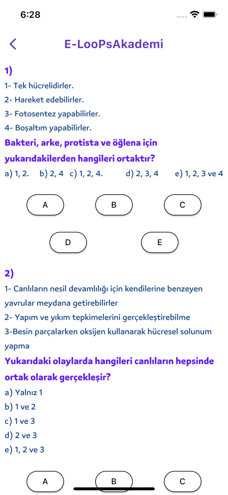

# Biyoloji TYT AYT 
## E-LooPsAkademi

## Uygulama İndirme Linkleri

Uygulamayı indirmek için aşağıdaki linklere tıklayabilirsiniz:

- [Google Play](https://play.google.com/store/apps/detailsid=com.Global.TRGame.BiyolojiTytAyt)
- [AppStore](https://apps.apple.com/tr/app/biyoloji-tyt-ayt/id1585574355)
- [E-LooPsAkademi WEB](https://www.eloopsakademi.com/)

"Biyoloji TYT AYT Uygulaması," Yükseköğretim Kurumları Sınavı'na (YKS) Biyoloji dersine hazırlık yapmak isteyen öğrencilere yönelik interaktif bir uygulamadır.

## Özellikler

- Biyoloji TYT ve AYT sorularıyla kapsamlı denemeler yapma imkanı.
- Farklı konulardaki interaktif öğrenme materyalleri.
- Sınav hazırlığınızı destekleyen eğlenceli ve etkili bir öğrenme deneyimi.

## Bildirimler

Uygulama, önemli sınav tarihleri, etkinlikler ve güncellemeler hakkında bildirimler gönderebilir. Bildirimleri almak için uygulamanın bildirim izinlerini etkinleştirmeniz gerekmektedir.

## Ekran Görüntüleri

  

    
    
  

  

    
    
  

  

    
    
  

  

    
    
  

  

    
    
  

